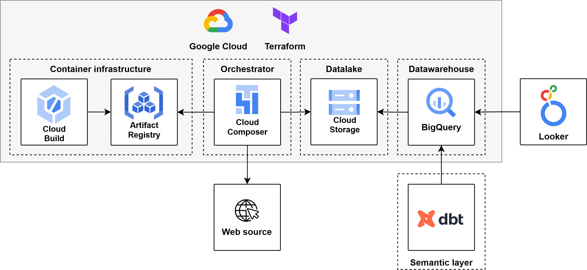

# Project for Data Engineering course from DataTalksClub

Data engineering project for TLC taxi Parquet data following an ELT model (extraction, load, transform) and using several technologies used during the [Data Engineering course from DataTalksClub](https://github.com/DataTalksClub/data-engineering-zoomcamp/). Personal course notes and work area available at: [https://github.com/hdt94/dtc-de-course](https://github.com/hdt94/dtc-de-course)

Contents:
- [Description](#description)
- [Setup (reproducibility)](#setup-reproducibility)

Datasets: https://www.nyc.gov/site/tlc/about/tlc-trip-record-data.page

Guiding references:
- https://github.com/DataTalksClub/data-engineering-zoomcamp/tree/main/week_7_project
- https://github.com/DataTalksClub/data-engineering-zoomcamp/blob/main/cohorts/2023/project.md

# Description

Public information provided by the New York city Taxi & Limousine Commission - TLC regarding taxi trips allows extracting insights about rates, demand, and mobility. The purpose of doing analytics on this data is to present most valuable descriptors of such dimensions.

Analytics dashboard is available at: https://lookerstudio.google.com/reporting/cf68a74a-c790-4b9b-98d0-d900966ebd6c

The system design follows an ELT model:
- Extraction/ingestion as batch process from web source: https://www.nyc.gov/site/tlc/about/tlc-trip-record-data.page
- Load into datalake and datawarehouse as external tables.
- Transform data within datawarehouse using semantic layer.

The system is implemented using Google Cloud, dbt, and Looker; the provisioning is made through Terraform; and the data pipeline has been developed for execution in a scheduled basis as well as ad-hoc basis, allowing custom parameterization for extracting/ingesting multiple years and vehicle types through Airflow/Composer manual DAG Run with config.

System design high-level diagram:


# Setup (reproducibility)
Setup may have two deployment options:
- Fully on cloud with Google Cloud and dbt Cloud.
- Hybrid optionally using local Airflow and/or local dbt core.

Setup requirements:
- GCP project, gcloud, git, jq, and terraform. Using [Cloud Shell](https://console.cloud.google.com/welcome?cloudshell=true) is recommended as it complies with all these requirements.
- Local Airflow and/or local dbt require a Python distribution.
- Local Airflow setup additionally requires docker.

Log in with gcloud if using other than Cloud Shell:
```bash
gcloud auth application-default login
```

Clone repo:
```bash
git clone https://github.com/hdt94/dtc-de-project && cd dtc-de-project
```

Update scripts execution mode:
```bash
chmod +x ./*.sh ./infrastructure/gcp/scripts/*.sh ./datawarehouse/dbt/trips/*.sh
```

Base environment variables:
- `secrets/` directory is part of [.gitignore](./.gitignore)
```bash
# if using Cloud Shell
export GCP_PROJECT_ID=$DEVSHELL_PROJECT_ID

# set value if using other than Cloud Shell
export GCP_PROJECT_ID=

# customizable variables
export BQ_DATASET=trips
export GCP_DBT_CREDENTIALS_FILE="$PWD/secrets/gcp_dbt_sa_credentials.json"
export GCS_DATA_BUCKET_NAME="datalake-$GCP_PROJECT_ID"
export GCP_REGION=us-central1
export ORCHESTRATOR_GCP_CREDENTIALS_FILE="$PWD/secrets/orchestrator_gcp_sa_credentials.json"

# enforcing local airflow, not provisioning Cloud Composer environment
export LOCAL_AIRFLOW=true
```

Initialize cloud resources using Terraform:
- script will generate a dbt BigQuery connection service account JSON file at `GCP_DBT_CREDENTIALS_FILE` location (see base variables)
- script will generate a connection service account JSON file at `ORCHESTRATOR_GCP_CREDENTIALS_FILE` location (see base variables) only if `LOCAL_AIRFLOW=true`
- script will generate an enviroment file `.env` with all relevant environment variables used in this repo. Any change to previous base environment variables requires re-running following script as these base variables are also written to environment file.
```bash
gcloud config set project $GCP_PROJECT_ID
RUN_ALL=true ./init-cloud-env.sh
```

## Cloud

Cloud Composer:
- Follow instructions [orchestration/airflow/README.md](./orchestration/airflow/README.md)

Cloud dbt:
- Fork repository to your GitHub account: https://github.com/hdt94/dtc-de-project/fork
- Create a dbt project: https://cloud.getdbt.com/
- Setup dbt project subdirectory to: `datawarehouse/dbt/trips`
- Setup BigQuery connection using the service account JSON file previously generated at `GCP_DBT_CREDENTIALS_FILE` location (see base variables): https://docs.getdbt.com/docs/quickstarts/dbt-cloud/bigquery#connect-dbt-cloud-to-bigquery
- Setup repository using Git Clone option: git@github.com:YOUR_GITHUB_USERNAME/dtc-de-project.git
- Add dbt deploy key to your repository: https://docs.getdbt.com/docs/cloud/git/import-a-project-by-git-url#github
- Follow instructions [datawarehouse/dbt/trips/README.md](./datawarehouse/dbt/trips/README.md)

## Local

Define variables to build environments:
```bash
export LOCAL_AIRFLOW=true
export LOCAL_DBT=true
```

Create local virtual environments:
- if `sqlite3` system library is too old "sqlite C library version too old (< 3.15.0)":
  - Download and update `sqlite3` binary: https://www.sqlite.org/download.html
  - Use a `conda` env: `BASE_CONDA_ENV=`
```bash
# Alternative 1: python distribution (change as needed)
BASE_PYTHON=python3.8 ./init-local-env.sh

# Alternative 2: conda env (change as needed)
BASE_CONDA_ENV=base ./init-local-env.sh
```

Local Airflow:
- WARNING: standalone mode is for development only, do not use it in production.
- Enable environment:
  ```bash
  set -a; source .env; set +a;
  source venvs/venv-airflow/bin/activate
  airflow standalone
  ```
- Follow instructions  [orchestration/airflow/README.md](./orchestration/airflow/README.md)

Local dbt:
- Enable environment:
  ```bash
  set -a; source .env; set +a;
  source venvs/venv-dbt/bin/activate
  cd datawarehouse/dbt/trips
  ```
- Follow instructions [datawarehouse/dbt/trips/README.md](./datawarehouse/dbt/trips/README.md)
